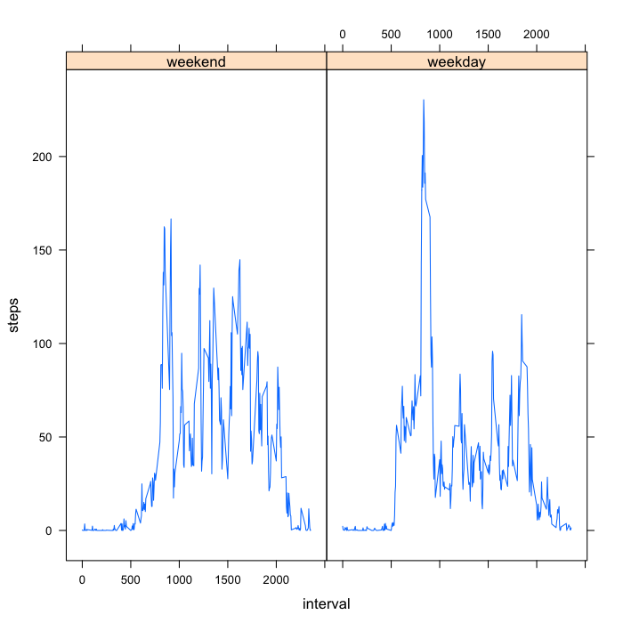

## Loading and preprocessing the data


```r
df = read.csv('activity.csv',as.is=T)
```


## What is mean total number of steps taken per day?


```r
df.no.NA = subset(df,!is.na(steps))
per.day = split(df.no.NA,df.no.NA$date)
per.day.total = sapply(per.day,function(x) sum(x$steps))
hist(
        per.day.total,
        xlab = 'Total number of steps taken each day',
        las = 1,main=''
        )
```

 

```r
mean = mean(per.day.total)
median = median(per.day.total)
```
The mean is 1.0766189 &times; 10<sup>4</sup> and the median is 10765 days.


## What is the average daily activity pattern?


```r
per.interval = split(df.no.NA,df.no.NA$interval)
per.interval.avg = sapply(per.interval,function(x) mean(x$steps))
plot(
        x = names(per.interval.avg),xlab='5-minute interval',
        y = per.interval.avg,ylab='Average number of steps taken',
        las = 1, type='l',bty='n'
        )
```

 

```r
m = which.max(per.interval.avg)
```

The 5-minute interval 835 contains the maximum number of steps, on average across all the days in the dataset: 206.1698113.


## Imputing missing values


```r
na = !complete.cases(df)
table(na)
```

```
## na
## FALSE  TRUE 
## 15264  2304
```
2304 lines contains missing values.

We impute the missing values using the mean for that 5-minute interval.

```r
withNA = df[!complete.cases(df),]
withNA$steps = per.interval.avg[as.character(withNA$interval)]
dfImputed = rbind(df.no.NA,withNA)
```


```r
per.day = split(dfImputed,dfImputed$date)
per.day.total = sapply(per.day,function(x) sum(x$steps))
hist(
        per.day.total,
        xlab = 'Total number of steps taken each day',
        las = 1,main=''
        )
```

 

```r
mean2 = mean(per.day.total)
median2 = median(per.day.total)
```
The mean is 1.0766189 &times; 10<sup>4</sup> and the median is 10765 days.

What is the impact of imputing missing data on the estimates of the total daily number of steps?


```r
mean==mean2
```

```
## [1] TRUE
```

```r
diff = median - median2
```
It shifts (increases) the median by 1.1886792.


## Are there differences in activity patterns between weekdays and weekends?


```r
date = as.Date(dfImputed$date)
dfImputed$day = weekdays(date)
dfImputed$we = factor(
        dfImputed$day %in% c('Saturday','Sunday'),
        labels = c('weekend','weekday'),
        levels = c('TRUE','FALSE')
        )
```


```r
library('lattice')
dfImputedAvg = unique(dfImputed[,c('interval','we')])
dfImputedAvg$steps = NA
for (i in 1:nrow(dfImputedAvg)){
        s = subset(dfImputed,
                interval==dfImputedAvg$interval[[i]]&
                        we==dfImputedAvg$we[[i]])
        dfImputedAvg$steps[[i]] = mean(s$steps)
}
xyplot(steps ~ interval | we,data=dfImputedAvg,type='l')
```

 

There are indeed some clear differences between weekend and weekdays, where the number of steps is more constant over the day during the weekend.


```r
sessionInfo()
```

```
## R version 3.0.2 (2013-09-25)
## Platform: x86_64-apple-darwin10.8.0 (64-bit)
## 
## locale:
## [1] C/UTF-8/C/C/C/C
## 
## attached base packages:
## [1] stats     graphics  grDevices utils     datasets  methods   base     
## 
## other attached packages:
## [1] lattice_0.20-29 knitr_1.8      
## 
## loaded via a namespace (and not attached):
## [1] evaluate_0.5.5 formatR_1.0    grid_3.0.2     stringr_0.6.2 
## [5] tools_3.0.2
```

